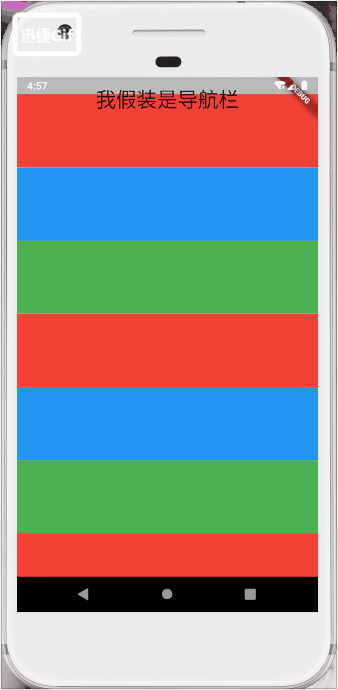
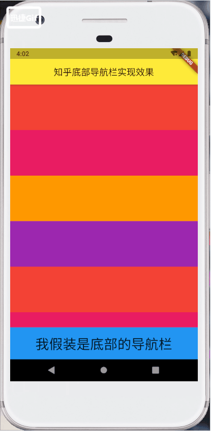
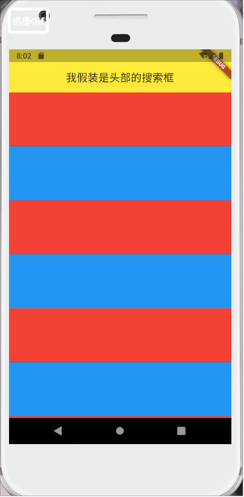

### 使用贝塞尔曲线实现一些优美的曲线图形(demo/bezier.dart)
* 

### 屏幕滚顶实现顶部appbar的透明度(demo/appBar_opacity.dart)
* 

### 模仿知乎实现上滑隐藏导航栏，下滑显示导航栏(demo/zhihu.dart)
* 

### 模仿音乐app首页和播放页的互动动画(demo/music.dart)
> 有bug，待修复

* 

### 模仿bilibili顶部下滑出现，上滑隐藏效果(demo/bilibili.dart)

* 

